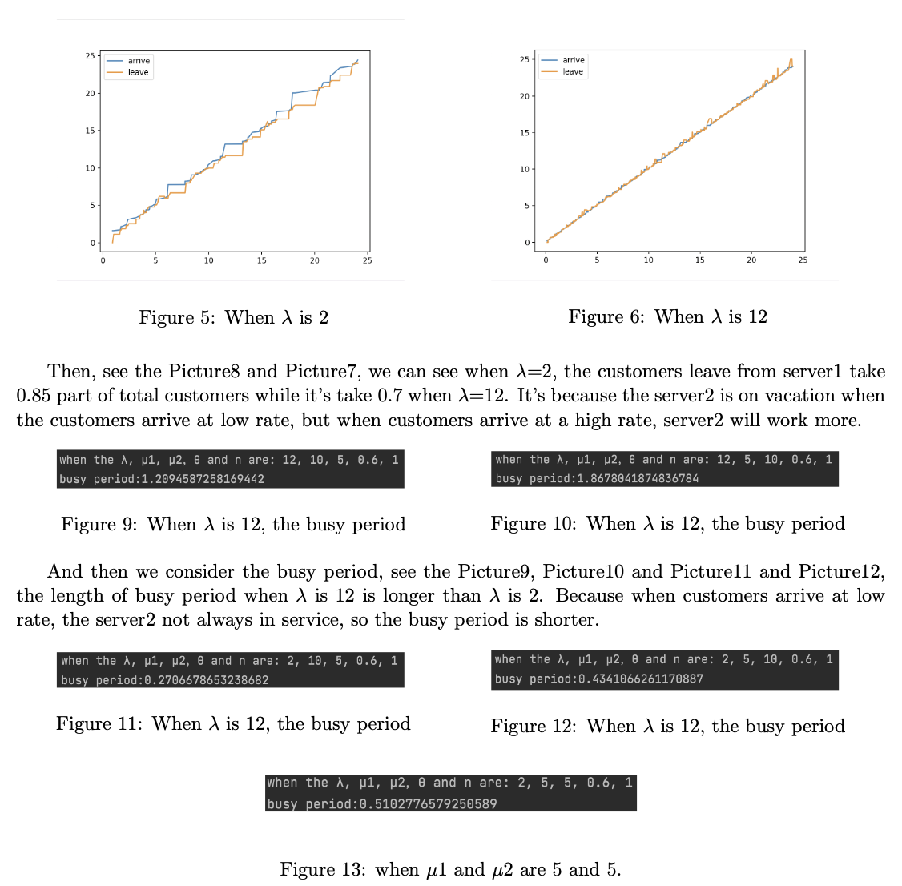

#  沈栩烽

## 教育背景
### 安徽大学 互联网学院    工学学士 网络工程  (2017.9-2021.6)
### 波士顿大学 工程学院    工学硕士 系统工程  (2021.9-2023.1)

## 兴趣方向 
### 随机过程，机器学习，深度学习
### Python C++

## 项目背景
### 一种 M/M/2 排队系统的分析与仿真 (随机过程，仿真):
#### (2022 年 5 月) 个人项目，关于一种 M/M/2 异步服务器排队系统，带有一个休假的研究。项目包含读相关论文，画出马尔科夫链，分析理论值并且使用 MATLAB 测试，用 Python 进行仿真，设置时钟变量追踪临近事件。最后将仿真结果与真实结果进行比对。

### 一个行人检测与距离测算系统 (深度学习，计算机视觉):
#### (2022 年 1 月 - 2022 年 5 月) 个人项目，构建一个行人检测与识别的系统，在检测部分我使用了 YOLO 模型因为其速度快，准确率高，符合使用需求。在测距部分我使用的是单目距离测算法，系统是基于 Python 的，可以被部署在任何设备上，有不错的准确率。

### 基于多任务学习的室内热舒适研究 (深度学习，TensorFlow): 
#### (2020 年 8 月 - 2021 年 5 月) 个人项目，学习了室内热舒适的各种检测指标，将影响因素看成 n 维向量作为模型输入，将 PMV 热舒适指标看做输出。模型使用多任务学习模型，可以有效地提高模型的泛化能力。测试了各个因素与指标的相关系数，选取了相关系数较高的进行输入，并得到一个不错的准确率。

### 互联网多模态搜索引擎 (深度学习，Pytorch): 
#### (2019 年 11 月 - 2020 年 2 月) 团队项目. 建造一个图片搜索引擎，输入文字可以输出对应的图片，这个项目用的是 ResNet-50，最训练了 30G 的图片，最终有一个%87 的准确率
